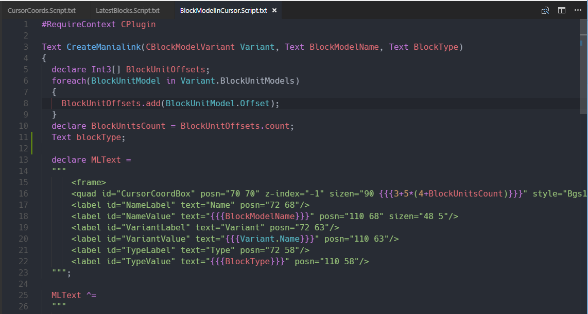

# vscode-maniascript README

VSCode Grammar support for ManiaScript; `".script.txt"` files.
For more information about ManiaScript, see http://doc.maniaplanet.com/creation/maniascript/index.html

## Known Issues

- Some language features have not yet been implemented

Initial release of vscode-maniascript

## Acknolwedgements

This was originally a port from [PRGfx/sublime-maniascript](https://github.com/PRGfx/sublime-maniascript), a sublime test plugin, but the textmate grammar has been completely reworked. More features coming soon, stay tuned.

## License

[MIT](./LICENSE)
